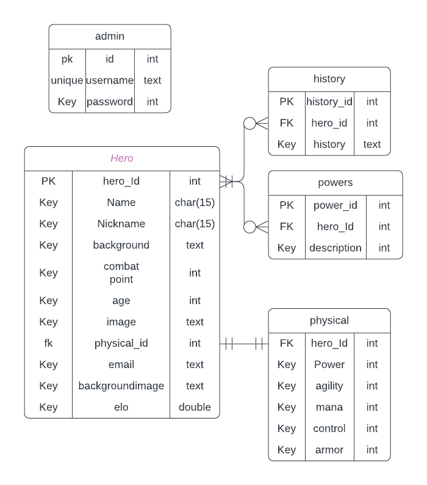

# ERD diagram for register system

### databse

Engels
- We will establish a third paradigm for the database, where the hero table serves as the primary entity. It may have
  either zero or one history, as well as a combat system. The combat system acts as a connector between the hero table
  and the physical and powers tables. Within a combat system, there can be one physical attribute and zero or more
  powers associated with it.
  
The hero will have basic information that he used to register, such as name, age, email, and a nickname.
The history table is for the missions the hero has completed like, rescuing someone, defeating an enemy etc.
The combat table includes a combat point field so that we can track their points.
The physical table contains the statistics of the hero. Speed represents how fast they can move. Power indicates how strong they are. Agility reflects how agile they are. Mana signifies how long they can last while using their powers. Control measures how effectively they can control their powers. Armor gauges the strength of their armor.
The powers table is used to provide more information about the types of powers they possess, such as telekinesis, super speed, etc.
This is the information we need to register our hero.

Nederlands
We gaan een derde paradigm instellen voor de database, waarbij de heldentabel als de belangrijkste entiteit fungeert. Deze tabel kan geen, één of twee geschiedenissen bevatten, en een gevechtssysteem. Het gevechtssysteem verbindt de heldentabel met de tabellen voor fysieke eigenschappen en krachten. In een gevechtssysteem kan één fysieke eigenschap worden opgenomen, samen met nul of meer krachten die eraan verbonden zijn.

De held bevat basisinformatie die hij heeft gebruikt bij registratie, zoals naam, leeftijd, e-mail en bijnaam.
De geschiedenistabel is bedoeld voor de missies die de held heeft voltooid, zoals het redden van iemand of het verslaan van een vijand.
De gevechtstabel bevat een veld voor gevechtspunten, waardoor we hun punten kunnen bijhouden.
De fysieke tabel bevat de statistieken van de held, zoals snelheid, kracht, behendigheid, mana, controle en pantser.
De krachtentabel wordt gebruikt om meer informatie te geven over de soorten krachten die ze bezitten, zoals telekinese, supersnelheid, etc.
Dit is de informatie die we nodig hebben om onze held te registreren